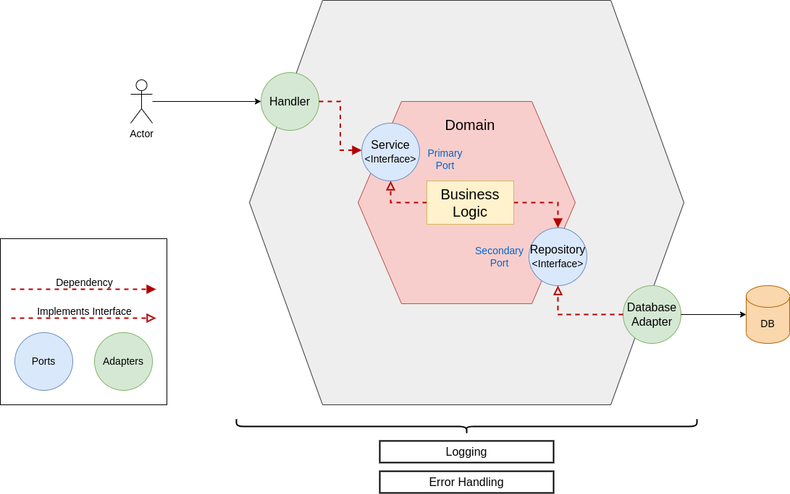

<div align="center">
  <h1>API para registro de de libros con autenticación JWT haciendo uso Go Fiber</h1>
</div>

# Introducción

Este repositorio contiene un proyecto base para desarrollar una API con Go Fiber.El objetivo de este repositorio es estructurar un proyecto base con Clean Architecture. Se establece la estructura de carpetas necesaria para el dominio, casos de usos, repositorios, controladores y elementos transversales, de esta manera se simplifica la etapa de desarrollo para que se centre en lo realmente necesario.

# Tabla de contenido

- [Estructura de carpetas](#estructura-de-carpetas)
- [Arquitectura limpia](#arquitectura-limpia)
- [Crear entidades del dominio](#crear-entidades-del-dominio)
- [Puertos](#puertos)
  - [Puertos primarios](#puertos-primarios)
  - [Puertos secundarios](#puertos-secundarios)
- [Adaptadores](#adaptadores)
  - [Adaptadores primarios](#adaptadores-primarios)
  - [Adaptadores secundarios](#adaptadores-secundarios)
- [Schema](#schema)
- [API](#api)
  - [Rutas](#rutas)
  - [Controladores](#controladores)
  - [Midleware](#middleware)
- [Elementos transversales](#elementos-transversales)
  - [logger](#logger)
  - [errs](#errs)
  - [utils](#utils)
- [Instalar dependencias](#instalar-dependencias)
- [Configurar las variables de entorno](#configurar-las-variables-de-entorno)
  - [Globales](#dependencias-globales)
  - [Compilación](#dependencias-de-compilación)
- [Correr aplicación](#correr-aplicación)
  - [Correr las migraciones](#correr-las-migraciones)
  - [Generar la documentación de Swagger](#generar-la-documentación-de-swagger)
  - [Iniciar la aplicación](#iniciar-la-aplicación)
  - [Observar la documentación de swagger](#observar-la-documentación-de-swagger)
- [Correr pruebas unitarias](#correr-pruebas-unitarias)

# Estructura de carpetas

Estructura base para el manejo de carpetas

```bash
.
├── /cmd
│   ├── /internal
|	|	├── /config				# Módulo con la configuración de la base de datos
|	|	├── /http 				# Infraestructura
|	|	|	├── handlers		# Módulo con los controladores para los endpoint
|	|	|	├── middlewares		# Contiene los middleware personalizados para Fiber
|	|	|	├── routes			# Rutas de los endpoint
|	|	|	└── server.go		# Módulo para iniciar la API
|	└── main.go					# Punto de entrada para la función main
├── /docs						# Este módulo es autogenerado y contiene los archivos necesarios para documentación de swagger
├── /internal
|	├── /domain					# Entidades del negocio
|	├── /http					# Los objetos de transferencias de datos
|	├── /repository				# Módulo con la implementaciones de los puertos secundarios
|	└── /service				# Casos de uso
├── /pkg						# Elementos transversales
|	├── /errs					# Módulo transversal para manejar los errores de la API
|	├── /logger					# Módulo transversal para imprimir los logs generados en la aplicación
|	└── /utils					# Funciones transversales a la aplicación
├── .env						# Archivo con las variables de entorno a usar
├── go.mod						# Se define el path del módulo, además de las dependencias para el proceso de compilación
└── go.sum						# Este archivo lista el checksum de las dependencia directa e indirecta, además de incluir la versión
```

# Arquitectura limpia

La base de este repositorio es la arquitectura de puertos y adaptadores, también conocida como la arquitectura hexagonal.



# Crear entidades del dominio

Todos los modelos de dominio se colocarán en el directorio **internal/domain**. Contiene la definición _go struct_ de cada entidad que forma parte del dominio y que puede ser utilizada en toda la aplicación.

**Nota**: no todos los _go struct_ son modelos de dominio. Sólo los structs que están involucrados en la lógica del negocio.

```Go
type Author struct {
	ID        uint   `gorm:"id;primary_key"`
	FullName  string `gorm:"full_name;not null;unique"`
	CreatedAt time.Time
	UpdatedAt time.Time
	DeletedAt gorm.DeletedAt `gorm:"index"`
	Books     []Book
}
```

Como se puede observar la estructura contiene tags del **ORM Gorm**, el cual, permite hacer usar de los modelos para correr las migraciones del **ORM**

# Puertos

Los puertos son la interfaz que pertenece al núcleo y definen cómo se debe abordar la comunicación entre los actores y el núcleo.

## Puertos primarios

Se definen los casos de uso que el núcleo implementara y se expone para ser consumido por los actores externos.

```Go
// AuthorService port secondary
type AuthorService interface {
	CreateAuthor(schema.AuthorRequest) *errs.AppError
	FindAllAuthor() ([]schema.AuthorResponse, *errs.AppError)
	FindAuthorById(uint) (*schema.AuthorResponse, *errs.AppError)
	UpdateAuthor(*schema.AuthorRequest) (*schema.AuthorResponse, *errs.AppError)
	DeleteAuthor(uint) *errs.AppError
}
```

## Puertos secundarios

Definen las acciones que la capa de datos debe implementar.

```Go
// AuthorRepository port interface
type AuthorRepository interface {
	SaveAuthor(*Author) *errs.AppError
	FindAllAuthor() ([]Author, *errs.AppError)
	FindAuthorById(uint) (*Author, *errs.AppError)
	UpdateAuthor(*Author) (*Author, *errs.AppError)
	DeleteAuthor(id uint) *errs.AppError
}
```

# Adaptadores

Esta capa que sirve para transformar la comunicación entre actores externos y la lógica de la aplicación de forma que ambas dos quedan independientes.

## Adaptadores primarios

Es la implementación de los casos de uso definidos en el puerto primario.

```Golang
// internal/service/author.go

package service

import (
	"github.com/karlbehrensg/go-fiber-template/internal/domain"
	"github.com/karlbehrensg/go-fiber-template/internal/http/requests"
	"github.com/karlbehrensg/go-fiber-template/internal/http/responses"
	"github.com/karlbehrensg/go-fiber-template/pkg/errs"
)

// AuthorService port primary
type AuthorService interface {
	CreateAuthor(requests.AuthorRequest) *errs.AppError
	FindAllAuthor() ([]responses.AuthorResponse, *errs.AppError)
	FindAuthorById(uint) (*responses.AuthorResponse, *errs.AppError)
	UpdateAuthor(*requests.AuthorRequest) (*responses.AuthorResponse, *errs.AppError)
	DeleteAuthor(uint) *errs.AppError
}

type DefaultAuthorService struct {
	repo domain.AuthorRepository
}

// NewAuthorService create a new instance of DefaultAuthorService
func NewAuthorService(repository domain.AuthorRepository) DefaultAuthorService {
	return DefaultAuthorService{repository}
}

// CreateAuthor use case for create author
func (s DefaultAuthorService) CreateAuthor(request requests.AuthorRequest) *errs.AppError {

	author := &domain.Author{
		FullName: request.FullName,
	}

	// calls repository to save author
	if err := s.repo.SaveAuthor(author); err != nil {
		return err
	}

	return nil
}

// FindAllAuthor use case for find all author
func (s DefaultAuthorService) FindAllAuthor() ([]responses.AuthorResponse, *errs.AppError) {
	var authors []domain.Author
	var err *errs.AppError
	// calls repository to find all author
	if authors, err = s.repo.FindAllAuthor(); err != nil {
		return nil, err
	}

	response := make([]responses.AuthorResponse, 0)
	for _, author := range authors {
		response = append(response, *author.ToNewAuthorResponse())
	}

	return response, nil
}

// FindAuthorById use case for find author by ID
func (s DefaultAuthorService) FindAuthorById(id uint) (*responses.AuthorResponse, *errs.AppError) {
	var author *domain.Author
	var err *errs.AppError
	// calls repository to find author by ID
	if author, err = s.repo.FindAuthorById(id); err != nil {
		return nil, err
	}

	response := *author.ToNewAuthorResponse()

	return &response, nil
}

// UpdateAuthor use case for update author
func (s DefaultAuthorService) UpdateAuthor(request *requests.AuthorRequest) (*responses.AuthorResponse, *errs.AppError) {
	author := &domain.Author{
		ID:       request.Id,
		FullName: request.FullName,
	}

	var err *errs.AppError
	// calls repository to update author
	if author, err = s.repo.UpdateAuthor(author); err != nil {
		return nil, err
	}

	response := *author.ToNewAuthorResponse()

	return &response, nil

}

// DeleteAuthor use case for delete author
func (s DefaultAuthorService) DeleteAuthor(id uint) *errs.AppError {
	// calls repository to delete author
	if err := s.repo.DeleteAuthor(id); err != nil {
		return err
	}

	return nil

}
```

## Adaptadores secundarios

Es la implementación de los puertos secundarios relacionados con la capa de datos.

```Go
// internal/repository/authorGorm.go

package repository

import (
	"fmt"
	"strings"

	"github.com/karlbehrensg/go-fiber-template/internal/domain"
	"github.com/karlbehrensg/go-fiber-template/pkg/errs"
	"github.com/karlbehrensg/go-fiber-template/pkg/logger"
	"gorm.io/gorm"
)

type AuthorRepositoryGorm struct {
	client *gorm.DB
}

// NewAuthorRepositoryGorm create a new instance of AuthorRepositoryGorm
func NewAuthorRepositoryGorm(dbClient *gorm.DB) AuthorRepositoryGorm {
	return AuthorRepositoryGorm{dbClient}
}

// SaveAuthor save author in database
func (r AuthorRepositoryGorm) SaveAuthor(author *domain.Author) *errs.AppError {
	if err := r.client.Create(author).Error; err != nil {
		logger.Error(err.Error())
		if strings.Contains(err.Error(), "ERROR: duplicate key value violates unique constraint ") {
			return errs.NewUnexpectedError("key full_name duplicate value")
		}
		return errs.NewUnexpectedError("Unexpected error from database")
	}

	return nil
}

// FindAllAuthor find all author in database
func (r AuthorRepositoryGorm) FindAllAuthor() ([]domain.Author, *errs.AppError) {
	authors := []domain.Author{}
	if err := r.client.Find(&authors).Error; err != nil {
		logger.Error(err.Error())
		return nil, errs.NewUnexpectedError("Unexpected error from database")
	}

	return authors, nil
}

// FindAuthorById find author by ID in database
func (r AuthorRepositoryGorm) FindAuthorById(id uint) (*domain.Author, *errs.AppError) {
	var author *domain.Author

	if err := r.client.Where("id = ?", id).First(&author).Error; err != nil {
		logger.Error(err.Error())
		if strings.Contains(err.Error(), "record not found") {
			return nil, errs.NewNotFoundError(err.Error())
		}
		return nil, errs.NewUnexpectedError("Unexpected error from database")
	}

	return author, nil
}

// UpdateAuthor update author in database
func (r AuthorRepositoryGorm) UpdateAuthor(author *domain.Author) (*domain.Author, *errs.AppError) {
	var result *gorm.DB
	if result = r.client.Where("id = ?", author.ID).Updates(&author); result.Error != nil {
		logger.Error(result.Error.Error())
		if strings.Contains(result.Error.Error(), "ERROR: duplicate key value violates unique constraint ") {
			return nil, errs.NewUnexpectedError("key full_name duplicate value")
		}
		return nil, errs.NewUnexpectedError("Unexpected error from database")
	}

	// validates if the rows have changed
	if result.RowsAffected < 1 {
		logger.Info(fmt.Sprintf("Row with id=%d cannot be updated because it doesn't exist", author.ID))
		return nil, errs.NewNotFoundError("Author not found")
	}

	return author, nil
}

// DeleteAuthor delete author in database
func (r AuthorRepositoryGorm) DeleteAuthor(id uint) *errs.AppError {
	var author *domain.Author
	var result *gorm.DB
	if result = r.client.Where("id = ?", id).Delete(&author); result.Error != nil {
		logger.Error(result.Error.Error())
		return errs.NewUnexpectedError("Unexpected error from database")
	}

	// validates if the rows have changed
	if result.RowsAffected < 1 {
		logger.Info(fmt.Sprintf("Row with id=%d cannot be deleted because it doesn't exist", id))
		return errs.NewNotFoundError("Author not found")
	}

	return nil
}
```

# Requests y Responses

Son un tipo de estructura que sirven únicamente para transportar datos, estas estructuras contienen las propiedades de la entidad. Las estructuras pueden tener su origen en una o más entidades.

Las estructuras del request se pueden usar para la validación de los datos de entrada.

```Go
// internal/http/requests/auth.go

package requests

type LoginRequest struct {
	Email    string `form:"email" validate:"required,email" example:"edwyn.rangel.externo@zeleri.com"`
	Password string `form:"password" validate:"required,min=7" example:"1234567"`
}
```

```Go
// internal/http/responses/auth.go

package responses

type LoginResponse struct {
	Token string `json:"token"`
}

```

La validación se hace llamando la función GetValidator() que se encuentra en la ruta utils/validator.go.

```Go
package utils

import "github.com/go-playground/validator/v10"

var validate *validator.Validate

// GetValidator Initiatilize validator in singleton way
func GetValidator() *validator.Validate {

	if validate == nil {
		validate = validator.New()
	}

	return validate
}

```

# Infraestructura para la API

Esta sección permite exponer los puntos de entrada de la aplicación a través del framework Fiber.

## Controladores

Son los elementos que contiene la lógica de los punto de entrada, en estas funciones se recibe la petición de los clientes y se llaman los casos de uso para el procesamiento de los datos, luego del que _core_ procesa los datos y se encarga de retornar una respuesta a los clientes.

```Go
// cmd/api/internal/http/handlers/author.go
...

type AuthorHandler struct {
	Service service.AuthorService
}

// CreateAuthor godoc
// @Summary create author.
// @Description endpoint for create authors.
// @Tags Author
// @Accept json
// @Produce json
// @Param Body body requests.AuthorRequest true "The body to author"
// @Success 201 {object} responses.AuthorResponse
// @Failure 400 {object} responses.ErrorResponse
// @Failure 401 {object} responses.ErrorResponse
// @Failure 500 {object} responses.ErrorResponse
// @Security Bearer
// @Router /author [post]
// CreateAuthor controller to create author
func (h AuthorHandler) CreateAuthor(c *fiber.Ctx) error {
	// Convert the request data to the structure
	data := &requests.AuthorRequest{}
	if err := c.BodyParser(&data); err != nil {
		logger.Error("Error decode json")
		return c.Status(fiber.StatusBadRequest).JSON(fiber.Map{
			"message": "Invalid data",
		})
	}

	// validates the structure
	if err := utils.GetValidator().Struct(data); err != nil {
		return c.Status(fiber.StatusBadRequest).JSON(fiber.Map{
			"message": err.Error(),
		})
	}

	// calls use case to create author
	if err := h.Service.CreateAuthor(*data); err != nil {
		return c.Status(err.Code).JSON(err.AsMessage())
	}

	return c.Status(fiber.StatusCreated).JSON(fiber.Map{
		"message": "Author created",
	})
}

...
```

## Middleware

Este módulo contiene los middleware personalizados para Fiber.

```Go
// cmd/api/internal/http/middlewares/jwt.go
...

// ValidateJWT middleware to validate JWT
func ValidateJWT() fiber.Handler {
	return func(c *fiber.Ctx) error {
		// Get token from header
		authHeader := c.Get("Authorization")
		if authHeader == "" {
			return c.Status(fiber.StatusUnauthorized).JSON(fiber.Map{
				"message": "Missing or malformed token",
			})
		}

		token := strings.TrimSpace(strings.Split(authHeader, " ")[1])
		if token == "" {
			return c.Status(fiber.StatusUnauthorized).JSON(fiber.Map{
				"message": "Missing or malformed token",
			})
		}

		// Validate token
		claims := &utils.JWTClaims{}
		if err := claims.ValidateToken(token); err != nil {
			logger.Error(err.Error())
			return c.Status(fiber.StatusUnauthorized).JSON(fiber.Map{
				"message": "Invalid or expired token",
			})
		}

		return c.Next()
	}
}
```

## Rutas

Este módulo contiene las rutas de la puntos de entradas, además se hace la implementación de las intancias de los servicios y los repositorios.

```Go
// cmd/api/internal/http/routes/author.go

...

// AuthorRoutes endpoints for the author section
func AuthorRoutes(router *fiber.App, dbClient *gorm.DB) {
	c := controller.AuthorController{Service: service.NewAuthorService(repository.NewAuthorRepositoryGorm(dbClient))}
	api := router.Group("/author")
	api.Use(middleware.ValidateJWT())
	api.Post("", c.CreateAuthor)
	api.Get("", c.GetAllAuthor)
	api.Get("/:id", c.GetAuthorById)
	api.Put("/:id", c.UpdateAuthor)
	api.Delete("/:id", c.DeleteAuthor)
}
```

El llamado de las rutas se hace en el archivo cmd/api/internal/http/server.go desde la función start()

```Go
// cmd/api/internal/http/server.go

...
// instantiating fiber
app := fiber.New()
// added middleware
app.Use(recover.New())
app.Use(fiberLogger.New())

// define routes
routes.SwaggerRoutes(app)
routes.AuthRoutes(app, dbClient)
routes.AuthorRoutes(app, dbClient)
routes.BookRoutes(app, dbClient)
routes.NotFoundRoute(app)

// run server
app.Listen(":" + os.Getenv("APP_PORT"))
```

# Elementos transversales

Esta compuesto por aquellos módulos que son transversales a la apliación.

## logger

Permite imprimir log estructurados y nivelados haciendo uso de la librería ZAP.

## errs

Son un conjunto de funciones que permite manejar los errores para la API.

## utils

Son todas las funciones genéricas que se pueden usar en la aplicación.

# Instalar dependencias

Para correr el proyecto sin problemas es necesario hacer la instalación de un conjunto de dependencias, entre las cuales se tiene las globales, que son un conjunto de paquetes que son implementadas para correr proceso de automatización como el swagger o mock para las pruebas unitarias. Y las dependencia de compilación, que son todas aquellas librerías necesarias para hacer que la aplicación funcione.

## Dependencias Globales

```
go install github.com/swaggo/swag/cmd/swag@latest
go install github.com/golang/mock/mockgen@v1.6.0
```

## Dependencias de compilación

Para instalar las dependencia de compilación, es necesario que primero se generen los mocks y la documentación de Swagger poruqe de lo contrario saldrán unas series de error por falta de esos archivos.

```
go mod tidy
```

# Configurar las variables de entorno

El archivo .env es opcional, en el se puede almacenar las variables de entorno necesarias a cargar. Este contiene la variable con el secreto para realizar el cifrado de JWT, conectar al servicio de base de datos y configuración de la aplicación.

```bash
# App
ENV=development
APP_PORT=8080

# Database
DB_HOST=localhost
DB_PORT=5432
DB_USER=postgres
DB_PASSWORD=postgres
DB_NAME=library
DB_SCHEMA=public
DB_SSL_MODE=disable
DB_TIME_ZONE=UTC

# JWT
JWT_SECRET=secret
```

Esta condición en el archivo app/app.go, permite cargar las variables de entorno desde el archivo .env cuando se este en el ambiente de desarrollo

```Go
if os.Getenv("ENV") != "production" {
    if err := godotenv.Load(); err != nil {
        logger.Error(fmt.Sprintf("Error godotenv %s", err.Error()))
    }
}
```

Posterior a esta condición se llama la función

```Go
utils.CheckEnv()
```

```Go
// utils/utils.go

// CheckEnv validate env required
func CheckEnv() {
	envProps := []string{
		"ENV",
		"DB_HOST",
		"DB_USER",
		"DB_PASSWORD",
		"DB_NAME",
		"DB_PORT",
		"DB_SSL_MODE",
		"DB_TIME_ZONE",
		"APP_PORT",
	}
	for _, k := range envProps {
		if os.Getenv(k) == "" {
			logger.Fatal(fmt.Sprintf("Environment variable %s not defined. Terminating application...", k))
		}
	}
}
```

Para validar la existencia de la variables de entorno necesarias para el funcionamiento de la aplicación, en caso de no existir alguna de estas variables se imprimirá un log indicando la variable de entorno faltante y se detendrá la aplicación.

# Correr aplicación

## Correr las migraciones

Para correr las migraciones primero se debe crear el cliente que hace la conexión hacia la base de datos

```Go
// config/database/postgres.go

// GetDbClient generates the client for the database
func GetDbClient() *gorm.DB {

	dataSource := os.ExpandEnv("host=${DB_HOST} user=${DB_USER} password=${DB_PASSWORD} dbname=${DB_NAME} port=${DB_PORT} sslmode=${DB_SSL_MODE} TimeZone=${DB_TIME_ZONE}")
	client, err := gorm.Open(postgres.Open(dataSource), &gorm.Config{
		NamingStrategy: schema.NamingStrategy{
			TablePrefix:   os.ExpandEnv("${DB_SCHEMA}."),
			SingularTable: false,
		}})
	if err != nil {
		logger.Fatal(err.Error())
	}
	logger.Info("Database connected")

	return client
}
```

En el archivo config/database/postgres.go también contiene la función que corre el proceso de migración.

```Go
// Migrate create the tables in the database
func Migrate(client *gorm.DB, models ...interface{}) {
	client.AutoMigrate(models...)
}
```

La creación del cliente y el llamado de la migración se hacen desde el archivo app/app.go

```Go
// app/app.go
...

// get client db
dbClient := database.GetDbClient()
// run migration
database.Migrate(dbClient, &domain.Author{}, &domain.Book{}, &domain.User{})
```

**Nota**: es necesario tener instalado postgres con una base de datos llamada igual que el valor de la env DB_NAME.

## Generar la documentación de Swagger

```
swag init -g cmd/api/main.go
```

**Nota**: cuando se genera la documentación de swagger en el directorio docs, el archivo docs.go importa la siguiente _github.com/swaggo/swag_ y esta se puede marcar como una dependencia faltate, para corregir el problema de dependencia es necesario correr nuevamente el comando `$ go mod tidy`

## Iniciar la aplicación

```
go run cmd/api/main.go
```

## Observar la documentación de swagger

open url [http://localhost:8080/swagger/](http://localhost:8080/swagger/)

Para generar la documentación Swagger se agregó bloque de texto comentando en el archivo main.go y en los archivos para los handler.

# Correr pruebas unitarias

Lo primero que se debe hacer es generar los mocks

```bash
go generate ./...
```

Luego de generar los mock se pueden correr las pruebas de la siguiente manera

```bash
go test -coverprofile=cover.out ./...
go tool cover -func=cover.out
```

Para visualizar la cobertura en el navegador se debe correr el siguiente comando

```bash
go tool cover -html=cover.out
```
